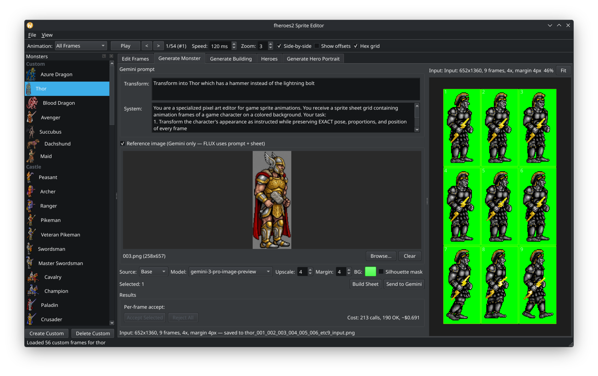

My long time favorite game is Heroes of the Might and Magic II and III. I play both of them since their creation in the late 1990s and early 2000s, and I still enjoy them.
I always wanted to create new units for those games, but my art skills are really bad. I managed to create smaller games with my brother where I supplied the programming and he did the art side, but this was always very limited in scope.

I really like the open source project fheroes2 which reimplements the engine in pretty readable C++ code and I wanted to create a simple mod for it adding a new unit based on the existing one.

To do that, I built (well Claude did) a sprite editor which sends selected frames from the original sprite sheet to Gemini
with custom background color and margin to ensure it is possible to slice it properly afterwards.

This process works pretty well, especially with manual tuning of the prompt and few attempts.

