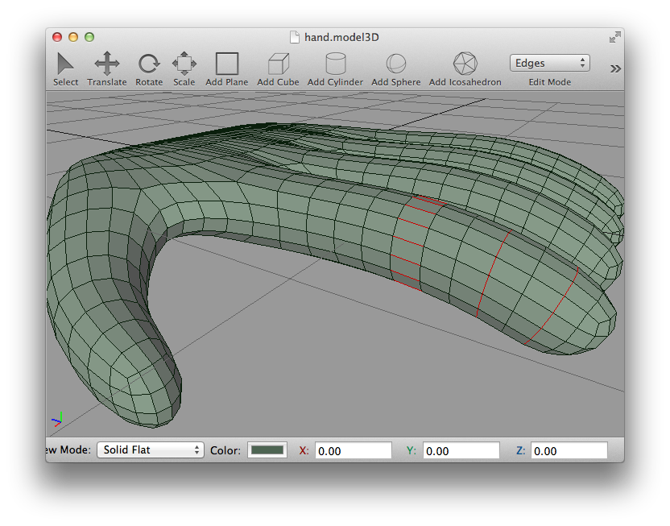
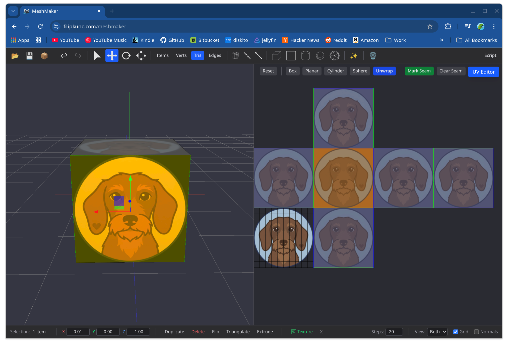

I started working on [MeshMaker](https://github.com/filipkunc/MeshMaker) around 2009 as an attempt to build a 3D mesh editor with very basic features and learn by doing. That same year I switched completely to Mac OS X as my daily driver and wanted to learn Objective-C, Core Graphics, and JavaScriptCore while reusing my old C++ code. I still think the original Objective-C++ hybrid was the best and easiest way to share C++ logic with native Cocoa UI. Around the same time I used C++/CLI with C# for the Windows port and C++ with Qt for the Linux port.

I developed it intensively until around 2015, then spent most of my energy on other projects, my day job, and family.

Recently I [wanted to port it to the web](/meshmaker) to make it natively available on all platforms, and to try a large scale port done purely with Claude and Copilot. I had to add a lot of tests to stop the LLMs from hallucinating and breaking things as soon as I reached the mesh editing operations. My strategy was to serialize manual testing into GoogleTest, use Playwright for the React UI, and add manual steering to land the right features. At one point I had to fix a feature entirely myself, because I could not push Claude at the time to stop breaking it.

I would still say the port is more than 98% done by AI, which is an amazing result. Adding in-browser scripting with Monaco calling back into Emscripten needed no manual fixes at all, just steering.

Adding support for [Hunyuan3D-2](https://huggingface.co/spaces/tencent/Hunyuan3D-2) for image and text to 3D was also done by AI. There I mainly had to make sure my GPU could handle it. Generating a textured model pushed me to the limit of 16 GB of VRAM and caused frequent crashes.

The port lives on the [`webgl2-port`](https://github.com/filipkunc/MeshMaker/tree/webgl2-port) branch.
