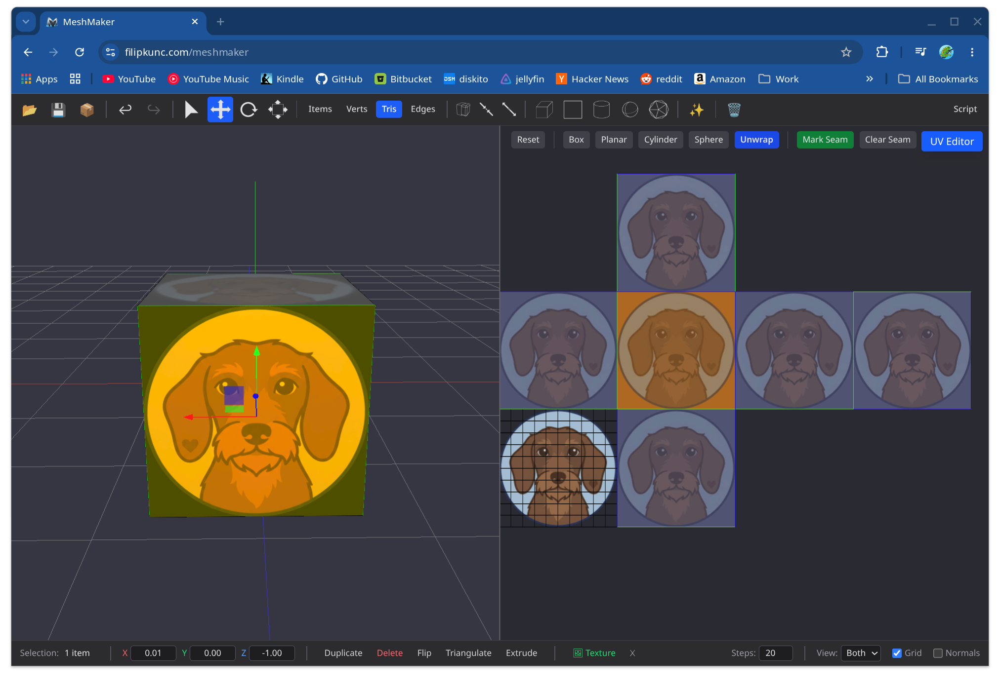

import Excerpt from '../../../components/Excerpt.astro';
import YouTube from '../../../components/YouTube.astro';

I started working on [MeshMaker](https://github.com/filipkunc/MeshMaker) around 2009 to build a 3D mesh editor with very basic features and learn by doing. That same year I switched completely to Mac OS X as my daily driver and wanted to learn Objective-C, Core Graphics, and JavaScriptCore while reusing my old C++ code. I still think the original Objective-C++ hybrid was the best and easiest way to share C++ logic with native Cocoa UI. Around the same time I used C++/CLI with C# for the Windows port and C++ with Qt for the Linux port. I developed it intensively until around 2015, then spent most of my energy on other projects, my day job, and family.

<YouTube id="sCezKOf22cc" title="MeshMaker: quads and edge loops" />
*The original native macOS app, a walkthrough of quads and edge loops.*

Recently I wanted to port it to the web so it would run on every platform with no install, and to see how far a large port could go driven purely by Claude and Copilot. It runs now.

**[Open the editor in your browser →](/meshmaker)**

## The porting strategy

The original code was a tangle of C++/CLI and C#. The same `.mm` files were shared across platforms with `#ifdef` blocks, compiled as Objective-C++ on macOS and as C++/CLI on Windows. Jumping straight to WebGL2 would have meant debugging the language port and the graphics port at the same time, so I split it in two.

First came a clean-room `WebGL2/` folder with a CMake build and the engine rewritten as plain C++17 against OpenGL 3.3, the desktop profile closest to WebGL2. Only once that ran natively did I add Emscripten as a second build target, where the same C++ compiles to WASM against WebGL2, which is OpenGL ES 3.0 in the browser. Every feature could be verified on the desktop build first, then again on the web.

That engine is about 22K lines of C++ handling mesh topology, selection, undo and redo, OBJ and glTF I/O, and UV unwrapping. None of the interesting algorithms were rewritten for the web. The seam-based UV unwrap is still the same Least Squares Conformal Mapping solver it always was, and subdivision still leans on a production library, which turned out to be one of the nicer surprises of the port.

*The WebGL2 port at filipkunc.com/meshmaker, a box-unwrapped textured cube in the UV editor.*

## Talking to the browser

The React frontend never touches the mesh data. The C++ engine exposes about a hundred functions through Emscripten's embind, and React calls them straight on the WASM module.

<Excerpt
  source="scripts/meshmaker/Bindings.cpp"
  lang="cpp"
  label="WebGL2/src/Bindings.cpp"
  href="https://github.com/filipkunc/MeshMaker/blob/webgl2-port/WebGL2/src/Bindings.cpp"
/>

On the JavaScript side that is just `module.addCube()` or `module.subdivideSelectedFaces()`. React polls a handful of state getters every 100ms to keep the toolbar in sync, and that is the whole bridge.

## Pixar's subdivision in the browser

Subdivision was the part I least wanted to reimplement. Smooth subdivision surfaces are fiddly to get right, and a hobby editor has no business hand-rolling them. So the port does not. It pulls in Pixar's own [OpenSubdiv](https://github.com/PixarAnimationStudios/OpenSubdiv) through CMake's FetchContent and compiles it to WASM alongside everything else.

The engine just hands it a topology descriptor and asks for a refinement. The one bit of real logic is choosing the scheme from the mesh itself, Catmull-Clark for quads and Loop for triangle meshes, then carrying the per-corner UVs through as a face-varying channel so textures survive the subdivision.

<Excerpt
  source="scripts/meshmaker/OpenSubdivHelper.cpp"
  lang="cpp"
  label="WebGL2/src/OpenSubdivHelper.cpp"
  href="https://github.com/filipkunc/MeshMaker/blob/webgl2-port/WebGL2/src/OpenSubdivHelper.cpp"
/>

So clicking Subdivide in a browser tab runs the same library Pixar uses in film production, on a mesh I can go back to editing by hand a second later.

## The tests that kept Claude honest

The original desktop app shipped with almost no automated tests, just two from 2009. That was fine while a human drove every change, but as soon as the port reached the mesh editing operations the models started hallucinating and quietly breaking things that already worked. Adding GoogleTest to the engine was the turning point. None of it existed before the port, and building it out was what made the rest possible. I serialized my manual test cases into more than 130 of them, covering transforms, UV mapping, seam marking, conformal unwrapping, subdivision, and edge splitting, plus 22 Playwright tests driving the real React UI.

A unit test pins the exact result of an operation so the model has nothing to negotiate. Catmull-Clark on the cube from the last section has one right answer, and this test spells out every count:

<Excerpt
  source="scripts/meshmaker/SubdivTests.cpp"
  lang="cpp"
  label="WebGL2/tests/SubdivTests.cpp"
  href="https://github.com/filipkunc/MeshMaker/blob/webgl2-port/WebGL2/tests/SubdivTests.cpp"
/>

The Playwright tests cover the other half, clicking the real toolbar and reading scene state back out of the WASM module. This one builds a scene, exports it to OBJ, clears, then reimports, all through the actual UI:

<Excerpt
  source="scripts/meshmaker/file-io.spec.ts"
  lang="ts"
  label="MeshMakerWeb/e2e/file-io.spec.ts"
  href="https://github.com/filipkunc/MeshMaker/blob/webgl2-port/MeshMakerWeb/e2e/file-io.spec.ts"
/>

Each operation had to keep passing before the next one was allowed to land, and from there almost everything landed with steering alone. One feature I still had to fix entirely by hand, because at the time I could not stop Claude from breaking it.

I would put the port at well over 90% written by AI, which still surprises me.

## Scripting and generation

Two later additions were almost pure steering. An in-browser scripting console wires a Monaco editor to about 150 of those same engine functions, so a few lines of JavaScript can drive the modeler. The one real snag was Emscripten's GLFW stealing keystrokes from the editor, which I fixed with a little [runtime monkey patching](/monkey-patching). Adding [Hunyuan3D-2](https://huggingface.co/spaces/tencent/Hunyuan3D-2) for image and text to 3D was mostly AI work too, and there the limiting factor was my GPU. Generating a textured model pushed past 16 GB of VRAM and crashed often.

The port lives on the [`webgl2-port`](https://github.com/filipkunc/MeshMaker/tree/webgl2-port) branch. [Open the editor](/meshmaker) and build something.
