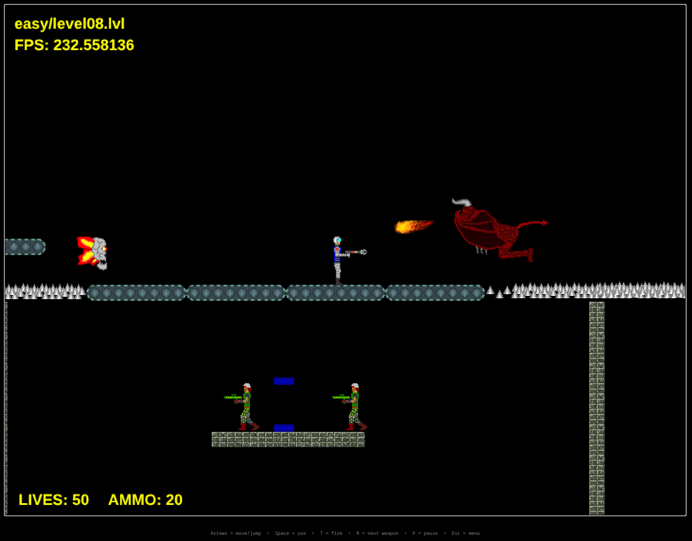

I worked on a bunch of hobby projects with my brother years ago, mostly games. The code has survived two decades of hard drives and OS reinstalls. The platforms it was built for have not, so I wanted to bring some of them back.

## Space Warrior

The Space Warrior is a 2D side-scrolling platformer my brother (graphics) and I (programming) built around 2002-2003 in
Visual Studio 6.
The game was heavily inspired by the [Duke Nukem](https://en.wikipedia.org/wiki/Duke_Nukem_(video_game)) and [Commander Keen](https://en.wikipedia.org/wiki/Commander_Keen) platformers.

I was 16 at the time, just learning C++ and Win32 programming. The first two books I had on C++ were covering only standard C++ from scratch and then MFC/Win32 programming.
Those were translated to Czech, but still pretty hard to follow. The MFC book from Jeff Prosise mentioned that for fast 2D graphics [DirectDraw](https://en.wikipedia.org/wiki/DirectDraw) is the way to go.

I went to the library and found a copy of Isometric Game Programming with DirectX by Ernest Pazera and started learning how to use DirectDraw.
At the time I knew only very basic English and had to heavily use dictionary from Czech to English and back to understand the concepts. I remember the first time I got a moving sprite on screen, it was a huge achievement for me.

In those days the DirectX SDK examples and [BltFast](https://learn.microsoft.com/en-us/windows/win32/api/ddraw/nf-ddraw-idirectdrawsurface7-bltfast) was the way to go for 2D graphics.
Transparency was a single color key and there was no alpha blending. I had Pentium 1 with 150 MHz and 32 MB of RAM. To get decent performance on 800x600 and 16 bit colors every performance issue was immediately visible.

Because of that I did not use Debug builds, only Release builds, to get manageable performance when testing the game and adding features.

The game code was a spaghetti mess with nearly 6000 lines of code in a single file. I wanted to organize it better, but basic C++ concepts were still very hard for me.
I especially struggled with dynamic allocations, so I leaned heavily on fixed arrays, static allocations, and global variables.

A few years later I re-did the renderer in OpenGL, and that OpenGL build is what Claude ported to
WebAssembly with Emscripten. The original game code is preserved as is, only the platform layer was replaced.

Play it here: [Space Warrior](/space-warrior). It works on a phone too, with a touch D-pad and on-screen buttons.

## Gentis

The early 2000s was an era of 3D games. Everyone was making 3D games, and I was no exception.
Gentis is a third-person 3D game concept I never quite finished. I started working on it around 2004-2005 and later continued around 2007-2008.
There was a break in the middle while I finished high school, and I picked it back up in my spare time during my first years at a full-time job.
By then I was comfortable writing and maintaining larger C++ programs, and had a good grasp of vectors, matrices, and collision detection.
I was still using the fixed-function pipeline in OpenGL for this game, but I was already experimenting with shaders via [NVIDIA's Cg language](https://www.nvidia.com/en-us/drivers/cg-tutorial-home/) and SDK.

Nearly 20 years later, I ported this one to WebGL2 by hand over a Christmas break. The rendering had to be rewritten from scratch, because the fixed-function pipeline simply does not exist in modern GL.

Play it here: [Gentis](/gentis).
